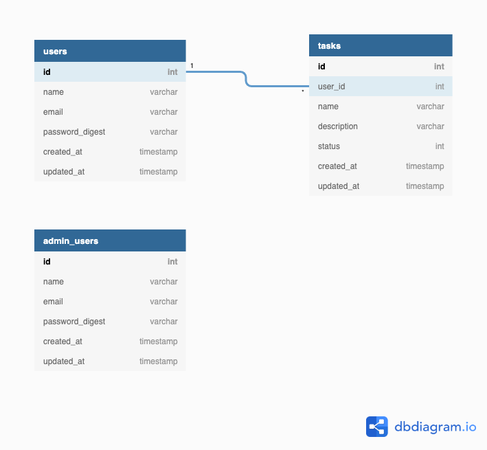
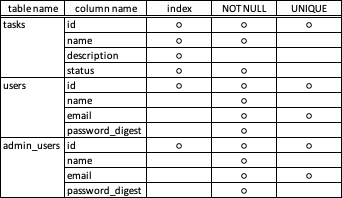
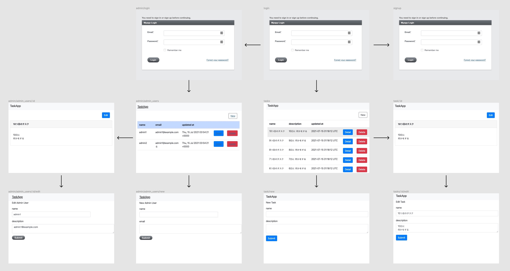

# training

## カリキュラム
`super-compact-version`

## アプリ起動方法
- Dockerインストール（既にインストール済みであればスキップしてください）
```
$ brew install --cask docker
```

- Rails, DBのコンテナ起動
```
$ docker-compose up -d
```

- DB作成
```
$ docker-compose run web rails db:create
```

- http://localhost:3000/ にアクセス

## ER図


## テーブル定義
index, NOT NULL制約, UNIQUE制約の対象のカラムのみ抜粋しました。


## 画面設計図

