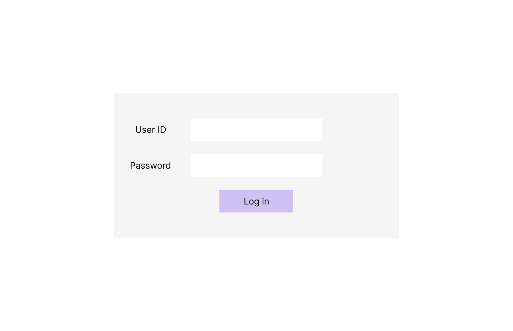
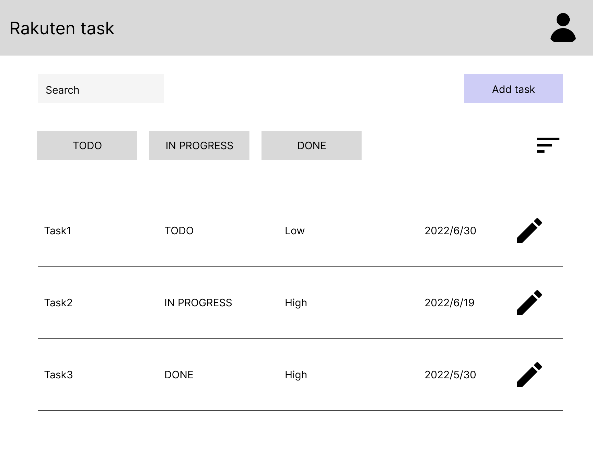
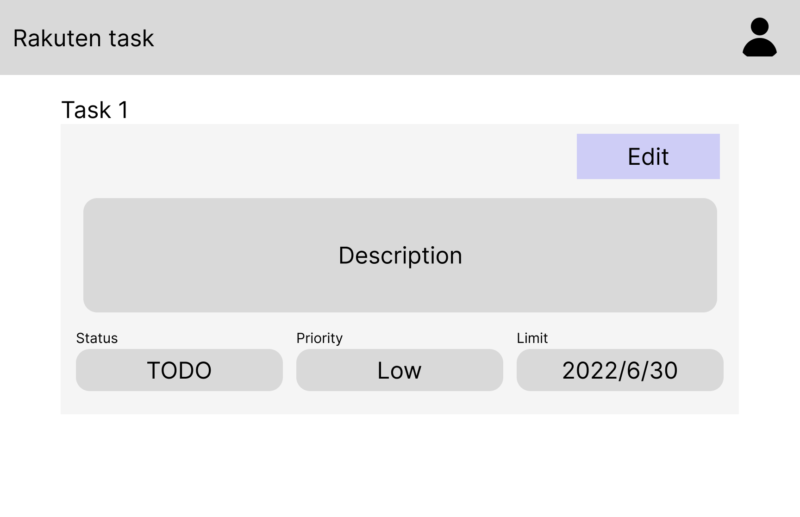
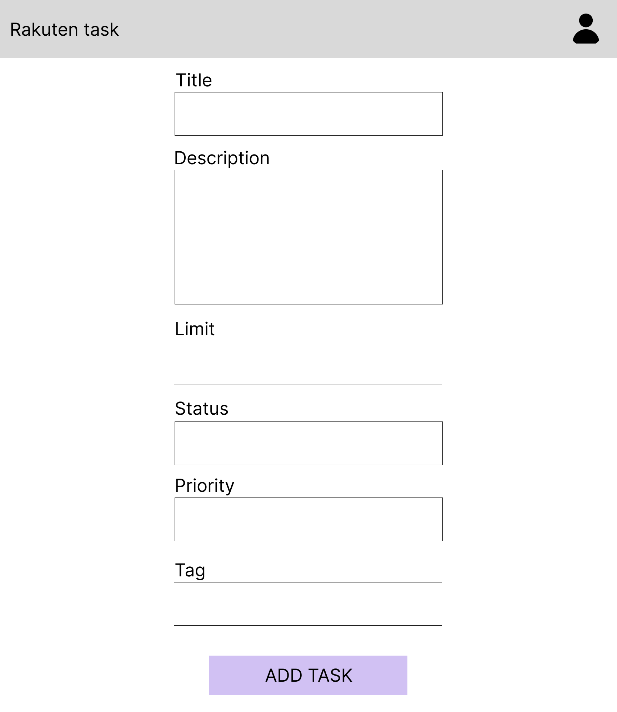
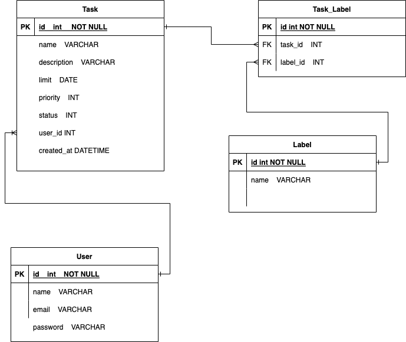

# Task Management App

## front design
### Login Page

### Task List Page

### Task Detail Page

### Edit/Add Task Page

## Database
### Task
| Name | Type | Description |
| -- | -- | -- |
| id | INT | PK, NOT NULL |
| name | VARCHAR | NOT NULL |
| description | VARCHAR | |
| priority | INT | 1: low, 2: normal, 3: high |
| status | INT | 1: TODO, 2: IN PROGRESS, 3: DONE |
| limit | DATE | |
| user_id | INT | FK, NOT NULL |
| created_at | DATETIME, NOT NULL |
| updated_at | DATETIME, NOT NULL |

### Label
| Name | Type | Description |
| -- | -- | -- |
| id | INT | PK, NOT NULL |
| name | VARCHAR | NOT NULL |

### Task_Label
| Name | Type | Description |
| -- | -- | -- |
| id | INT | PK, NOT NULL |
| task_id | INT |　FK, NOT NULL |
| label_id | INT | FK, NOT NULL |

### User
| Name | Type | Description |
| -- | -- | -- |
| id | INT | PK, NOT NULL |
| name | VARCHAR | NOT NULL |
| email | VARCHAR | NOT NULL |
| password | VARCHAR | NOT NULL |

### ER Diagram
