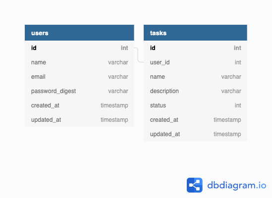

# training

## ER図


## このカリキュラムについて

この文書は、楽天株式会社ラクマ事業部で必須とされるRuby on Railsとその周辺技術の基礎を習得するための新入社員教育用カリキュラムです。
<details>
新入社員の能力によらず、必ず一通りのステップを実施していただきます。
研修期間は特に定めておりません。
すべてのステップを完了した時点で研修修了となります。

本カリキュラムでは、以下の登場人物を想定しています。

- 新入社員（メンティー） : 本カリキュラムの受講者です。
- メンター : 新入社員の教育・指導・助言を行います。また、新入社員と相談して仕様を一緒に決めたりする役割も担います。
  - レビューに関しては、メンター１人への負荷軽減・チームメンバーがメンティーのレベルを理解するよい機会になることから、チーム内で分担して行うことを推奨します。

指導について、メンターがどの程度関与するかどうかはメンターの裁量に一任します。また、研修期間については、新入社員のスキルレベルや社内の案件状況を考慮して、メンターの方であらかじめ目安を設定する予定です。

## ライセンス

このカリキュラムは[クリエイティブ・コモンズ 表示 - 非営利 - 継承 4.0 国際 ライセンス](https://creativecommons.org/licenses/by-nc-sa/4.0/deed.ja)の下に提供されています。

[](https://creativecommons.org/licenses/by-nc-sa/4.0/deed.ja)
</details>

## 概要

### システムの要件

本カリキュラムでは、課題としてタスク管理システムを開発していただきます。
タスク管理システムでは、以下のことを行いたいと考えています。

- 自分のタスクを簡単に登録したい
- タスクに終了期限を設定できるようにしたい
- タスクに優先順位をつけたい
- ステータス（未着手・着手・完了）を管理したい
- ステータスでタスクを絞り込みたい
- タスク名・タスクの説明文でタスクを検索したい
- タスクを一覧したい。一覧画面で（優先順位、終了期限などを元にして）ソートしたい
- タスクにラベルなどをつけて分類したい
- ユーザ登録し、自分が登録したタスクだけを見られるようにしたい
- メンテナンスを実施できるようにしたい

また、上記の要件を満たすにあたって、次のような管理機能がほしいと考えています。

- ユーザの管理機能

**※ ただし、メンターの判断で特定機能の実装をスキップしてもらう場合があります。**
  **「★」のマークが付いているステップに関してはメンターの指示のもと、実装してください。**

**（メンターは、メンティーの開発経験・各ステップの実装の質を元にスキップするかの判断を行ってください）**


### サポートブラウザ

- サポートブラウザはmacOS/Chrome各最新版を想定しています

### アプリケーション（サーバ）の構成について

以下の言語・ミドルウェアを使って構築していただきたいです（いずれも最新の安定バージョン）。

- Ruby
- Ruby on Rails
- MySQL

※ 性能要求・セキュリティ要求は特に定めませんが、一般的な品質で作ってください。
  あまりにサイトのレスポンスが悪い場合は改善をしていただきます

## 本カリキュラムの最終目標

本カリキュラムの終了時点で、以下の項目を習得することを想定しています。

- Railsを利用した基本的なWebアプリケーションの実装ができるようになること
- Railsアプリケーションで一般的な環境を使ってアプリケーションを公開できること
- 公開されたRailsアプリケーションに対して、機能の追加やデータのメンテナンスができること
- GitHubでPRをしてマージする一連の流れを習得すること。また、それに必要なGitのコマンドを習得すること
  - 適切な粒度でコミットができること
  - 適切にPRの説明文が書けること
  - レビューに対する対応と修正が一通りできること
- 不明な点を適切なタイミングでチームメンバーや関係者に（今回はメンターになります）口頭やチャットなどで質問ができること

## 課題ステップ

### ステップ0: chrome-extensionをインストールしよう

実はこのtrainingは株式会社万葉が作ったものが元となっていて、間違えて本家のリポジトリに向かってPRを作るという事件が何回か起きてしまいました。
この悲劇を繰り返さないためにページが自動でリダイレクトされるchrome-extensionをインストールしましょう。

#### 0-1: chrome-extensionをcloneする

`git clone git@github.com:Fablic/fablic-chrome-extension.git`

#### 0-2: chrome-extensionをインストールする

chrome://extensions/ を開いて右上のDeveloper modeをオンにして、RKGithubSupportToolをドラッグ&ドロップでインストールしましょう。

#### 0-3: 株式会社万葉に感謝しつつトレーニングを始める

[本家のリポジトリ](https://github.com/everyleaf/el-training)

### ステップ1: Railsの開発環境を構築しよう

#### 1-1: Rubyのインストール

- [rbenv](https://github.com/rbenv/rbenv)を利用して最新バージョンのRubyをインストールしてください
- `ruby -v` コマンドでRubyのバージョンが表示されることを確認してください

#### 1-2: Railsのインストール

- GemコマンドでRailsをインストールしましょう
- 最新バージョンのRailsをインストールしてください
- `rails -v` コマンドでRailsのバージョンが表示されることを確認してください

### ステップ2: Railsプロジェクトを作成しよう

- このリポジトリをcloneして、配下にRailsアプリケーションを作成していきます。
- `rails new` コマンドでアプリケーションに最低限必要なディレクトリやファイルを作成しましょう
- `rails new` してできたプロジェクトのディレクトリ（アプリ名のディレクトリ）の直下に `docs` というディレクトリを作り、この文書ファイルをコミットしましょう
- 作成したアプリをGitHub上に作成したブランチにpushしましょう
- バージョンを明示するため、利用するRubyのバージョンを `Gemfile` に記載しましょう（Railsは既にバージョンが記載されていることを確認しましょう）
- その際、以下のようにブランチを作成して、ステップごとに以下のように進めていってください

```
master
`---super-compact-version
    `---your-name ←Step3で作成するブランチ
        `---your-name-stepX ←各ステップで作成し、your-nameブランチにマージするPRを作成する
```

### ステップ3: 作りたいアプリケーションのイメージを考える(★オプション）

- 設計を進める前に、どのようなアプリになるか完成イメージを（メンターと一緒に）考えてみましょう。ペーパープロトタイピングによる画面設計などがおすすめです
- システムの要件を読んで、必要なデータ構造を考えてみましょう
  - どのようなモデル（テーブル）が必要そうか
  - テーブル内にどのような情報が必要そうか
- データ構造を考えたら、それをモデル図に手書きで書いてみましょう
  - 完成したら撮影して、リポジトリに入れましょう
  - `README.md` にテーブルスキーマを記載しましょう（モデル名・カラム名・データ型）

※ 現時点で正解のモデル図を作成する必要はまだありません。現時点での想定として作ってみましょう（今後のステップで間違いと思ったら改修していくイメージです）

### ステップ4: データベースの接続設定（周辺設定）をしましょう

- まずGitで新たにトピックブランチを切りましょう
  - 以降、トピックブランチ上で作業をしてコミットをしていきます
- Bundlerをインストールしましょう
- `Gemfile` で `mysql2` （MySQLのデータベースドライバ）をインストールしましょう
- `database.yml` の設定をしましょう
- `rails db:create` コマンドでデータベースの作成をしましょう
- `rails db` コマンドでデータベースへの接続確認をしましょう
- GitHub上でPRを作成してレビューしてもらいましょう
  - コメントがついたらその対応を行ってください。
  - LGTM（Looks Good To Me）がついたら自分のマスターブランチにマージしましょう

### ステップ5: タスクモデルを作成しましょう

タスクを管理するためのCRUDを作成します。
まずは名前と詳細だけが登録できるシンプルな構成で作りましょう。

- `rails generate` コマンドでタスクのCRUDに必要なモデルクラスを作成しましょう
- マイグレーションを作成し、これを用いてテーブルを作成しましょう
  - マイグレーションは1つ前の状態に戻せることを担保できていることが大切です！ `redo` を流して確認する癖をつけましょう
- `rails c` コマンドでモデル経由でデータベースに接続できることを確認しましょう
  - この時に試しにActiveRecordでレコードを作成してみる
- GitHub上でPRを作成してレビューしてもらいましょう

### ステップ6: タスクを登録・更新・削除できるようにしよう

- タスクの一覧画面、作成画面、詳細画面、編集画面を作成しましょう
  - `rails generate` コマンドでコントローラとビューを作成します
  - コントローラとビューに必要な実装を追加しましょう
  - 作成、更新、削除後はそれぞれflashメッセージを画面に表示させましょう
- `routes.rb` を編集して、 `http://localhost:3000/` でタスクの一覧画面が表示されるようにしましょう
- GitHub上でPRを作成してレビューしてもらいましょう
  - 今後、PRが大きくなりそうだったらPRを2回以上に分けることを検討しましょう

### ステップ7: テストを書こう

- specを書くための準備をしましょう
  - `spec/spec_helper.rb` 、 `spec/rails_helper.rb` を用意しましょう
- Model/Controller specをタスク機能に対して書きましょう

### ステップ8: アプリのタイムゾーン設定を行いましょう

- Railsのタイムゾーンを日本（東京）に設定しましょう

### ステップ9: バリデーションを設定してみよう

- バリデーションを設定しましょう
  - どのカラムにどのバリデーションを追加したらよいか考えてみましょう
  - 合わせてDBの制約も設定するマイグレーションを作成しましょう
  - マイグレーションファイルだけを作成するため、 `rails generate` コマンドで作成します
- 画面にバリデーションエラーのメッセージを表示するようにしましょう
- バリデーションに対してモデルのテストを書いてみましょう

### ステップ10: ステータスを追加して、検索できるようにしよう

- ステータス（未着手・着手中・完了）を追加してみよう
- 一覧画面でタイトルとステータスで検索ができるようにしよう
- 絞り込んだ際、ログを見て発行されるSQLの変化を確認してみましょう
  - 以降のステップでも必要に応じて確認する癖をつけましょう
- 検索インデックスを貼りましょう
- 検索に対してmodel specを追加してみよう（feature specも拡充しておきましょう）

### ステップ11: 複数人で利用できるようにしよう（ユーザの導入）

- ユーザモデルを作成してみましょう
- 最初のユーザをseedで作成してみましょう
- ユーザとタスクが紐づくようにしましょう
  - 関連に対してインデックスを貼りましょう
  - N+1問題を回避するための仕組みを取り入れましょう

### ステップ13: ログイン/ログアウト機能を実装しよう

- 追加のGemを使わず、自分で実装してみましょう
  - DeviseなどのGemを使わないことで、HTTPのCookieやRailsにおけるSessionなどの仕組みについて理解を深めることが目的です
  - また、一般的な認証についての理解を深めることも目的にしています（パスワードの取り扱いについてなど）
- ログイン画面を実装しましょう
- ログインしていない場合は、タスク管理のページに遷移できないようにしましょう
- 自分が作成したタスクだけを表示するようにしましょう
- ログアウト機能を実装しましょう

### ステップ14: メンテナンス機能を作ろう

- メンテナンスを開始／終了するバッチを作ってみましょう
- メンテナンス中にアクセスしたユーザはメンテナンスページにリダイレクトさせましょう
