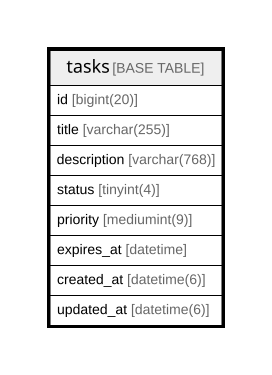

# tasks

## Description

<details>
<summary><strong>Table Definition</strong></summary>

```sql
CREATE TABLE `tasks` (
  `id` bigint(20) NOT NULL AUTO_INCREMENT,
  `user_id` bigint(20) NOT NULL COMMENT 'ユーザーID',
  `title` varchar(255) NOT NULL COMMENT 'タイトル',
  `description` varchar(768) DEFAULT NULL COMMENT '内容',
  `status` tinyint(4) DEFAULT NULL COMMENT 'ステータス',
  `priority` mediumint(9) DEFAULT NULL COMMENT '優先度',
  `expires_at` datetime DEFAULT NULL COMMENT '期限日時',
  `created_at` datetime(6) NOT NULL,
  `updated_at` datetime(6) NOT NULL,
  PRIMARY KEY (`id`)
) ENGINE=InnoDB DEFAULT CHARSET=utf8mb4
```

</details>

## Columns

| Name | Type | Default | Nullable | Extra Definition | Children | Parents | Comment |
| ---- | ---- | ------- | -------- | --------------- | -------- | ------- | ------- |
| id | bigint(20) |  | false | auto_increment |  |  |  |
| user_id | bigint(20) |  | false |  |  |  | ユーザーID |
| title | varchar(255) |  | false |  |  |  | タイトル |
| description | varchar(768) |  | true |  |  |  | 内容 |
| status | tinyint(4) |  | true |  |  |  | ステータス |
| priority | mediumint(9) |  | true |  |  |  | 優先度 |
| expires_at | datetime |  | true |  |  |  | 期限日時 |
| created_at | datetime(6) |  | false |  |  |  |  |
| updated_at | datetime(6) |  | false |  |  |  |  |

## Constraints

| Name | Type | Definition |
| ---- | ---- | ---------- |
| PRIMARY | PRIMARY KEY | PRIMARY KEY (id) |

## Indexes

| Name | Definition |
| ---- | ---------- |
| PRIMARY | PRIMARY KEY (id) USING BTREE |

## Relations



---

> Generated by [tbls](https://github.com/k1LoW/tbls)
