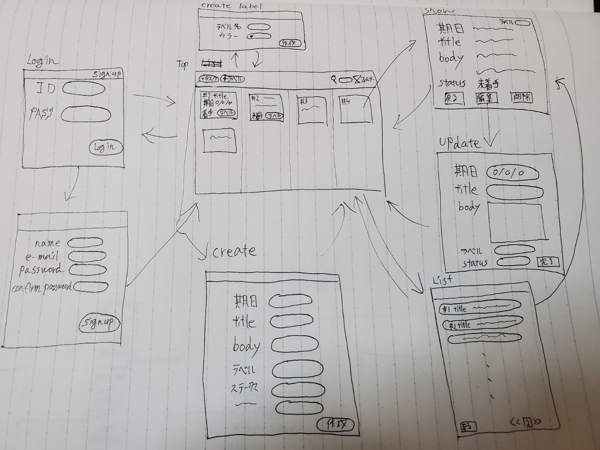

# README

# App Design

Top画面は緊急度/優先度マトリクスの各フィールドを横並びにしたようなデザインにして、
ユーザーが視覚的に優先度を理解できるようなタスク管理アプリをイメージして作成してみました。

# DB schema
## Users
| 項目名 | 制約 | Column | Type | NULL | Options |
| --- | --- | --- | --- | --- | --- |
| ユーザーID |  PK | id | INT | NO | unique |
| 名前      |     | name     | VARCHAR(45) | NO | - |
| メールアドレス |  | email    | VARCHAR(45) | NO | unique |
| パスワード |     | password | VARCHAR(45) | NO | - |
| 削除フラグ |     | deleted  |     INT     | NO (default 0) | - |
| 作成日 |        | create_at | DATETIME   | NO | - |v
| 更新日 |        | update_at | DATETIME   | NO | - |v

## Tasks
| 項目名 | 制約 | Column | Type | NULL | Options |
| --- | --- | --- | --- | --- | --- |
| タスクID   | PK |     id | INT | NO | unique |
| ユーザーID | FK | user_id | INT | NO | - |
| タイトル   |  | title   | VARCHAR(45) | NO | - |
| 内容      |  | body    | VARCHAR(255) | YES | - |
| ステータス |  | status  |     INT     | NO | - |
| 緊急度    |  | urgency  |     INT     | NO | - |
| 重要度    |  | importance |   INT    | NO | - |
| 優先順位ポイント |  | priority_point |  INT | NO | - |
| 期限      |  | deadline  | DATETIME  | NO | - |
| 削除フラグ |  | deleted  |    INT     | NO (default 0) | - |
| 作成日    |  | create_at | DATETIME  | NO | - |
| 更新日    |  | update_at | DATETIME  | NO | - |

## Labels
| 項目名 | 制約 | Column | Type | NULL | Options |
| --- | --- | --- | --- | --- | --- |
| ラベルID  |  PK | id      | INT | NO | unique |
| ユーザーID | FK | user_id | INT | NO | - |
| 名前      |     | name     | VARCHAR(45) | NO | - |
| カラー    |     | color    | INT | NO | enumを利用 |
| 削除フラグ |     | deleted  | INT | NO (default 0) | - |
| 作成日     |     | create_at | DATETIME  | NO | - |
| 更新日     |     | update_at | DATETIME  | NO | - |

## belong_tasks
| 項目名 | 制約 | Column | Type | NULL | Options |
| --- | --- | --- | --- | --- | --- |
| 所属タスクID | PK | id      | INT | NO | unique |
| ユーザーID   | FK | user_id | INT | NO | - |
| ラベルID     | FK | label_id | INT | NO | - |
| 削除フラグ   |    | deleted   | INT | NO (default 0) | - |
| 作成日       |    | create_at | DATETIME  | NO | - |
| 更新日       |    | update_at | DATETIME  | NO | - |