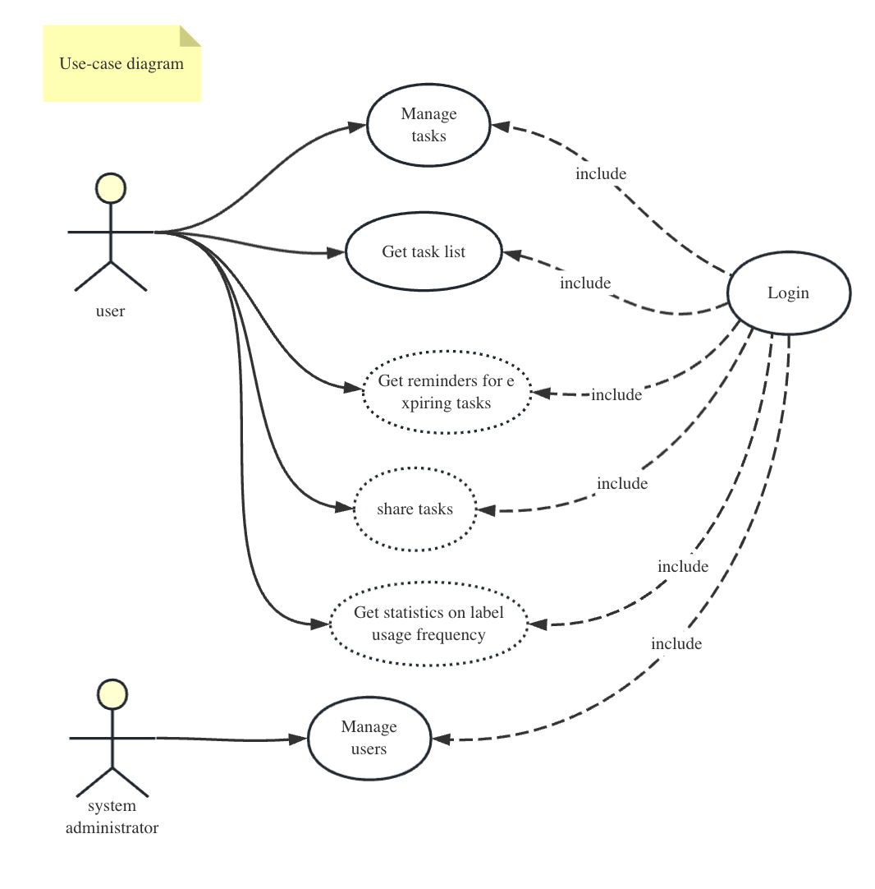
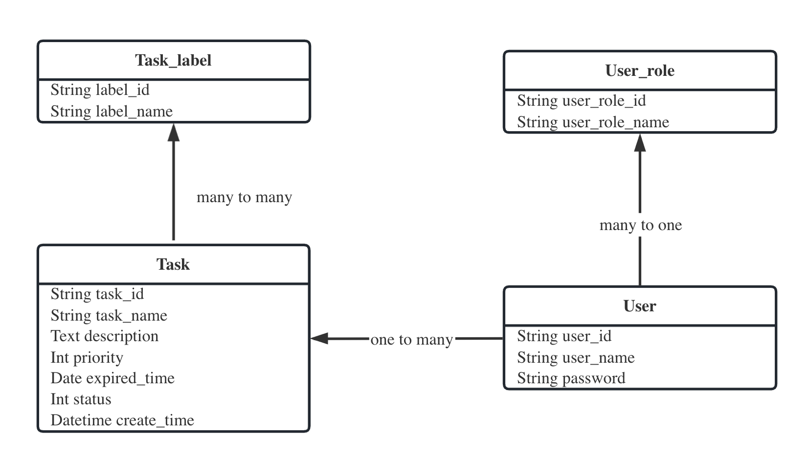

# Rails training by yuji_K

## Design

### Use-case diagram

### Class diagram

## Process

Considering the clarity of the PR review, I think I will follow the existing process to submit the corresponding PR.

## Tech & Framework

For the backend, I will use ruby&rails for development, there will be no other choice.

But the front-end implementation is a bit more diverse, we can write the front-end directly without the framework, but
also try to use React / Vue for front-end development.

So far, I have found that Hotwire was introduced in rails 7 version, according to my current naive understanding, this
is a front-end framework used for rails projects without writing js, maybe I can have a try with this new framework.

