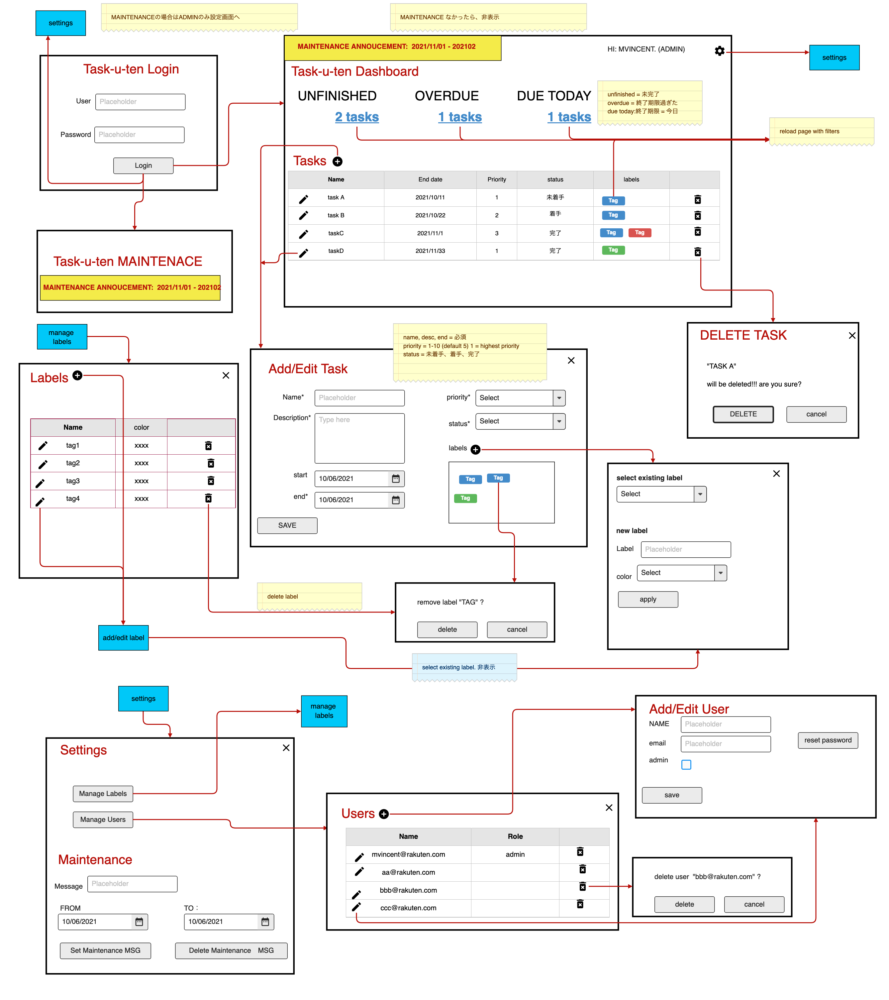

## システムの要件

本カリキュラムでは、課題としてタスク管理システムを開発していただきます。
タスク管理システムでは、以下のことを行いたいと考えています。

- 自分のタスクを簡単に登録したい　（登録、編集、削除）
    - タスクに終了期限を設定できるようにしたい　(startdate, enddate必須) - startdate任意
    - タスクに優先順位をつけたい (priority)　 「1-10」　
    - ステータス（未着手・着手・完了）を管理したい (status) 
    - タスクにラベルなどをつけて分類したい (label複数可能)
    - updated_at, created_at, deleted_at
- タスク管理　　（一覧画面）
    - ステータスでタスクを絞り込みたい
    - タスク名・タスクの説明文でタスクを検索したい
    - タスクを一覧したい。一覧画面で（優先順位、終了期限などを元にして）ソートしたい

- ユーザ管理　（ログイン、ログアウト、登録、編集、PWリセット、削除）
    - ユーザ登録し、自分が登録したタスクだけを見られるようにしたい
- 設定画面
    - メンテナンスを実施できるようにしたい

また、上記の要件を満たすにあたって、次のような管理機能がほしいと考えています。

- ユーザの管理機能（一覧画面）

# 画面フロー・設計

**※ ただし、メンターの判断で特定機能の実装をスキップしてもらう場合があります。**
  **「★」のマークが付いているステップに関してはメンターの指示のもと、実装してください。**

**（メンターは、メンティーの開発経験・各ステップの実装の質を元にスキップするかの判断を行ってください）**

# DB SCHEMA
## tasks
| column name | data        | default | not null | notes         |
| ----------- | ----------- | ------- | -------- | ------------- |
| id          | bigint      |         | ○        | primary key   |
| created_by  | bigint      |         | ○        | fkey users.id |
| name        | string(256) |         | ○        |               |
| description | text        |         |          |               |
| started_at  | timestamp   |         |          |               |
| finished_at | timestamp   |         |          |               |
| created_at  | timestamp   |         | ○        |               |
| updated_at  | timestamp   |         | ○        |               |

## users
| column name | data        | default | not null | notes       |
| ----------- | ----------- | ------- | -------- | ----------- |
| id          | bigint      |         | ○        | primary key |
| name        | string(256) |         | ○        |             |
| username    | string(256) |         | ○        |             |
| pw          | string(256) |         |          |             |
| first_run   | boolean     | true    | ○        |             |
| admin       | boolean     | false   | ○        |             |
| created_at  | timestamp   |         | ○        |             |
| updated_at  | timestamp   |         | ○        |             |

## labels
| column name | data        | default | not null | notes         |
| ----------- | ----------- | ------- | -------- | ------------- |
| id          | bigint      |         | ○        | primary key   |
| created_by  | bigint      |         | ○        | fkey users.id |
| name        | string(256) |         | ○        |               |
| created_at  | timestamp   |         | ○        |               |
| updated_at  | timestamp   |         | ○        |               |

## task_labels
| column name | data        | default | not null | notes          |
| ----------- | ----------- | ------- | -------- | -------------- |
| id          | bigint      |         | ○        | primary key    |
| task_id     | bigint      |         | ○        | fkey tasks.id  |
| label_id    | string(256) |         | ○        | fkey labels.id |
| created_at  | timestamp   |         | ○        |                |
| updated_at  | timestamp   |         | ○        |                |

## maintenance
| column name | data        | default | not null | notes         |
| ----------- | ----------- | ------- | -------- | ------------- |
| id          | bigint      |         | ○        | primary key   |
| created_by  | bigint      |         | ○        | fkey users.id |
| name        | string(256) |         | ○        |               |
| started_at  | timestamp   |         |          |               |
| finished_at | timestamp   |         |          |               |
| created_at  | timestamp   |         | ○        |               |
| updated_at  | timestamp   |         | ○        |               |

### サポートブラウザ

- サポートブラウザはmacOS/Chrome各最新版を想定しています

### アプリケーション（サーバ）の構成について

以下の言語・ミドルウェアを使って構築していただきたいです（いずれも最新の安定バージョン）。

- Ruby
- Ruby on Rails
- MySQL
- Docker Compose

※ 性能要求・セキュリティ要求は特に定めませんが、一般的な品質で作ってください。
  あまりにサイトのレスポンスが悪い場合は改善をしていただきます

## （番外編）オプション要件

必須要件とは別に、タスク管理システムに関するオプション要件を以下に示します。
メンターと相談しつつ必要に応じて実施してみてください。

### オプション要件1:  終了間近や期限の過ぎたタスクがあった場合、アラートを出したい

- ログインした時点で、どこかに終了間近や期限の過ぎたタスクを表示してみましょう
- 既読などが分かるようになるとよりよい

### オプション要件2:  ユーザの間でタスクを共有できるようにしたい

- 複数人で同じタスクを参照・編集できるようにしたい
  - 例：メンターとメンティーでタスクを共有できること
- 作成者を表示する

### オプション要件3: グループを設定できるようにしたい

- オプション要件2の続き
- グループを設定できるようにして、グループ内だけでタスクを参照できるようにしたい

### オプション要件4: タスクに添付ファイルをつけられるようにしたい

- タスクに対して添付ファイルをつけられるようにしてみましょう
- Herokuの場合はS3バケットにアップロードした添付ファイルを管理するようにします
- 適切にGemを選別して利用してみましょう

### オプション要件5: ユーザにプロフィール画像を設定できるようにしてみましょう

- ユーザがプロフィール画像を設定できるようにしましょう
- アップロードした画像はアイコンとして使用するので、遅くならないようにサムネイル画像も作りたい
- 適切にGemやライブラリを選別しましょう

### オプション要件6: タスクカレンダーの機能がほしい

- 終了期限を可視化するために、カレンダーに終了期限別にタスクを表示するようにしてみましょう
- ライブラリの使用・不使用は自由です

### オプション要件7: タスクをドラッグ&ドロップで並べ替えられるようにしたい

- タスク一覧でタスクをドラッグ&ドロップして並べ替えできるようにしてみましょう

### オプション要件8: ラベルの使用頻度をグラフ化してみましょう

- 統計情報を可視化するために、グラフを導入してみましょう
- グラフの種類は見やすいものを提案してみましょう

### オプション要件9: 終了間近のタスクを作成ユーザ宛てにメール通知してみましょう

- 終了間近のタスクがある場合、バックグラウンドでメール通知してみましょう
- メール送信はクラウドサービスを利用します
  - HerokuならばSendGrid
  - AWSならばAmazon SESなど
- 1日1回のバッチで送信するようにしてみましょう
  - HerokuならばHeroku Scheduler（アドオン）
  - AWSだったらcronを設定してみる

### オプション要件10: AWS にインスタンスを作って環境構築する

- AWSに環境構築をしてデプロイしてみましょう
- ミドルウェアはNginx+Unicornを推奨構成とします
- EC2のインスタンス等はサーバ要件を参照してください

### オプション要件11: ラベルをつけるにあたりjavascriptを用いて非同期処理にて取得するようにしましょう

- ステップ20の続き
- タスク登録時のラベル初期表示時は、非表示(ラベルデータ未取得)にしてみましょう
- 変わりにラベル追加などのボタンを用意し、そのボタン押下にてラベルデータを取得し表示するようにしてみましょう
- テストも書きましょう
