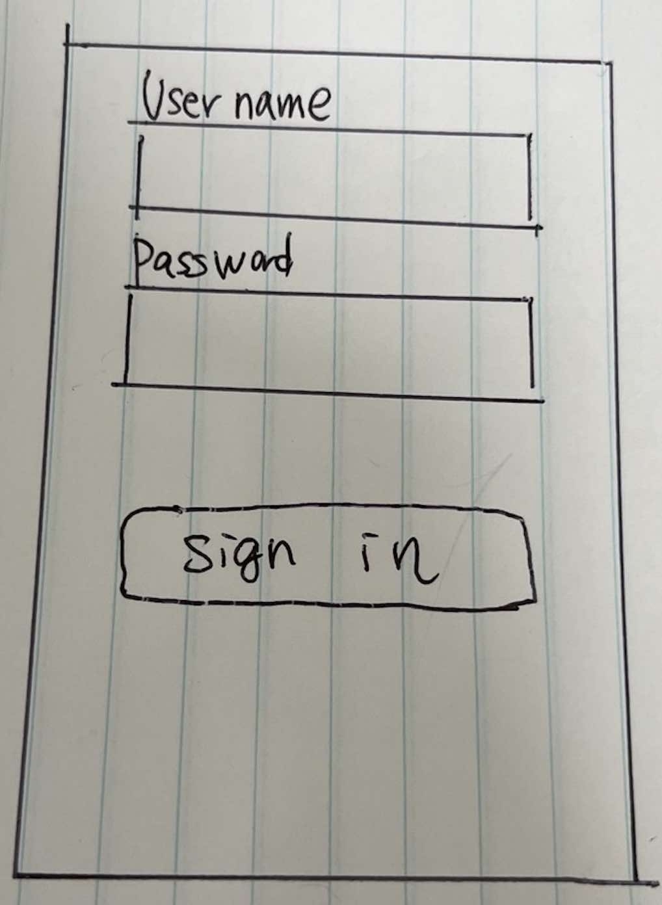
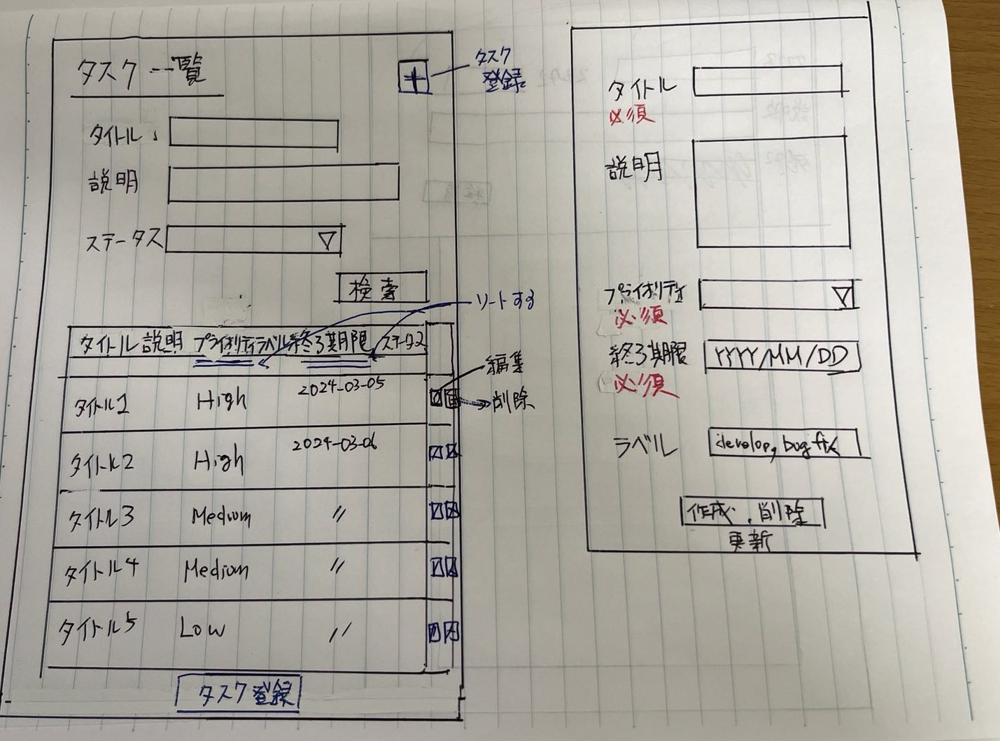

# はじめに
以下にタスクアプリの画面設計および、テーブル設計示す。

## 画面設計

## テーブル設計

テーブルは以下の4種類
- users
- tasks
- task_to_labels
- labels

### users
first_name, last_nameは削除しました。nameをlogin_nameに変更しました。

| Name         | Nullable | Default | Note            |
| ------------ | -------- | ------- | --------------- |
| id           | no       | | |
| login_name   | no       | | |
| password     | no       | | |
| role         | no       | standard | admin, standard|
| status       | no       | active | active, inactive|
| created_at   | no       | | |
| updated_at   | no       | | |
| deleted_at   | yes      | NULL | |

#### index of users
- idx_users_on_login_name (login_name)

### tasks

| Name         | Nullable | Default | Note               |
| ------------ | -------- | ------- | ------------------ |
| id           | no       | | |
| user_id      | no       | | |
| title        | no       | | |
| description  | yes      | NULL | |
| status       | no       | open | open, medium, closed|
| due_date     | no       | | |
| priority     | no       | high | high, medium, low   |
| created_at   | no       | | |
| updated_at   | no       | | |
| deleted_at   | yes      | NULL | |

#### index of tasks
- idx_tasks_on_priority (title)
- idx_tasks_on_status (status)
- idx_tasks_on_priority (priority)
- idx_tasks_on_due_date (due_date)

### task_to_labels
不要なnameカラムを削除しました。

| Name         | Nullable | Default | Note |
| ------------ | -------- | ------- | ---- |
| id           | no       | | |
| task_id      | no       | | |
| label_id     | no       | | |
| created_at   | no       | | |
| updated_at   | no       | | |
| deleted_at   | yes      | NULL | |

### labels
| Name         | Nullable | Default | Note |
| ------------ | -------- | ------- | ---- |
| id           | no       | | |
| name         | no       | | |
| created_at   | no       | | |
| updated_at   | no       | | |
| deleted_at   | yes      | NULL | |
