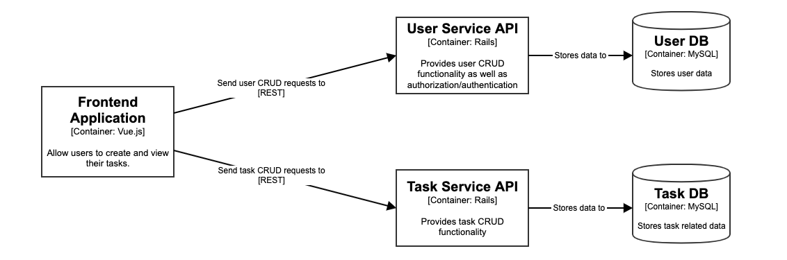
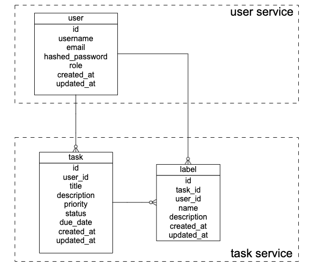

Todos App
====
This is a todos app built with Ruby on Rails that does following key features
* Task creation
* Due date setting for tasks
* Priority setting for tasks
* Status setting for tasks (not started / started / completed)
* Task grouping by status
* Task search by title and description
* Task sorting by priority, due date and so on
* Label creation for tasks
* User management
* Maintenance mode

# Service Design

- Frontend application will talk to User Service API to do all CRUD operations related to users.
  The User Service will also be responsible for authentication/authorization for the users.
- Frontend application will talk to Task Service API to do all CRUD operations related to tasks.
- Each service will have its own DB instance.

# Logical Model Relation

## User
| Column | Type |
| ------ | ---- |
| id     |  INT |
| username | VARCHAR |
| email | VARCHAR |
| hashed_password | VARCHAR |
| role | INT |
| created_at | DATETIME |
| updated_at | DATETIME |

## Task
| Column | Type |
| ------ | ---- |
| id     |  INT |
| user_id | INT |
| title | VARCHAR |
| description | VARCHAR |
| priority | INT |
| status | INT |
| due_date | DATETIME |
| created_at | DATETIME |
| updated_at | DATETIME |

## Label
| Column | Type |
| ------ | ---- |
| id     |  INT |
| task_id | INT |
| user_id | INT |
| name | VARCHAR |
| description | VARCHAR |
| created_at | DATETIME |
| updated_at | DATETIME |